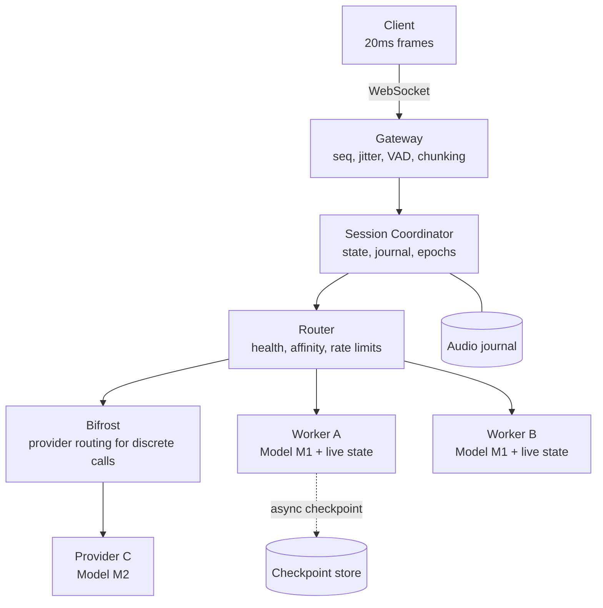

# Build plan

## Ground truth

**Purpose.** Build a fault-tolerant ASR serving system in which the audio and model internals are a black box, and the engineering is session state, model-specific inference cache, routing, replay, failover and observability.

**Primary goal.** Demonstrate that a live session survives worker failure — and, when necessary, a model or provider change — without corrupting the transcript.

### Confirmed facts

1. Clients send a frame approximately **every 20 milliseconds**. This is the **arrival cadence**.
2. **The cadence says nothing about how much audio a frame carries.** Payload duration is declared in per-frame metadata or derived after decode — never inferred from arrival timing. If a frame happens to carry exactly 20ms at 16kHz mono s16le, that is 320 samples / 640 bytes / \~256 kbps per stream, but treat that as one possible case, not the contract.
3. Because of 1 and 2 together, **a chunking layer is mandatory**: something must accumulate incoming frames, by declared duration, into inference-sized work.
4. Traffic may be **online** (interactive, latency-bound) or **offline** (batch, throughput-bound).
5. The ASR model may be treated as a black box. **Transcription quality is explicitly not being graded.**
6. Bifrost is part of model/provider routing.
7. VAD is in scope.
8. A performance datum from the interview: roughly 1-2 seconds of audio processed in \~50ms, i.e. RTF ≈ 0.025-0.05.
9. A target of \~200ms average round trip was discussed, decomposed as \~100ms network, \~50ms inference, \~50ms queue and overhead.
10. The system must emphasise: low latency, fault tolerance, routing, fallback, 429 handling, state correctness, backpressure, and inference-cache handling.
11. Diarization is **not** in scope.

### Correction carried into every section

An earlier draft of this plan recorded the cadence as 20 *seconds* and built invariants around never inferring payload duration from "the 20-second submission cadence." That is wrong by three orders of magnitude and it changes the architecture, so it is corrected everywhere below.

What the correct cadence implies that a 20-second one would not:

|  | At 20s | At 20ms (actual) |
| --- | --- | --- |
| Real-time constraint | none | hard |
| Jitter buffering | unnecessary | required |
| Frame as inference unit | natural | **catastrophic** — 50 calls/sec/session |
| Chunking layer | not needed | **essential** |
| VAD gating | optional | the main cost saving |
| Backpressure | theoretical | the primary overload mechanism |

**What survives from the earlier draft, and matters more than it looks:** arrival cadence and payload duration are independent. The original warning was right in substance even though its number was wrong. Keep it as a hard validation rule — every frame declares or derives its duration, the server never assumes one, and the chunker accumulates by duration rather than by frame count. A system that quietly assumes 20ms per frame will silently mis-size every chunk the moment a client batches two frames into one message.

### What remains unspecified

State these as assumptions in the README rather than guessing silently:

- **Audio format.** Assume 16kHz mono PCM s16le; require it in the session-open message and reject anything else.
- **Which latency milestone the 200ms refers to.** It is achievable as time-to-final-segment on short utterances (production vendors publish \~260ms median) and not achievable as end-to-end time-to-first-token (vendors sit near a second there). Declare which you target.
- **Concurrency target.** Pick one, justify it with the capacity arithmetic in the routing section, and demonstrate it.
- **Whether partial transcripts are required.** Assume yes for online, no for offline.

## Principles and invariants

### The central principle

> **Audio is the recovery source of truth. Model-specific inference state is an optimisation.**

Normal path:

```
audio frames -> chunk -> session owner -> model + its live state
                                              |
                                              +-- transcript delta
                                              +-- evolved state
```

Failure path:

```
worker or model failure
        |
   can the target restore THIS EXACT state format?
        |
        +-- YES -> restore checkpoint + replay the audio tail
        |
        +-- NO  -> discard state + replay retained audio into fresh state
```

This fork appears in the architecture, the algorithms, the benchmarks and the demo. It is the thesis of the submission.

### Terminology

Use **inference state cache** as the general term; "KV cache" is a special case.

- Transformer decoders hold literal key/value tensors.
- Streaming Conformers hold attention cache plus convolution context.
- RNN-T holds encoder state plus predictor state.
- CTC with a recurrent encoder holds hidden state and no attention cache at all.
- Runtimes serialise all of these differently, or not at all.

> A KV cache is model-specific inference state. It is not a portable format that moves between arbitrary ASR models.

Knowing this distinction, and saying it plainly, is worth more than naming a technique.

### The five granularities

Conflating these is the classic mistake, and at a 20ms cadence it is fatal:

| Unit | Scale | Purpose |
| --- | --- | --- |
| Arrival cadence | one frame per \~20ms | how often bytes show up |
| Frame payload | declared per frame, not assumed | the audio actually inside it |
| VAD window | 512 samples (\~32ms at 16kHz) | speech/silence decision |
| Inference chunk | 100-300ms online, seconds offline | what the model is actually called with |
| Utterance | 1-10s | the result unit; the finalisation boundary |
| Request | one utterance | what a stateless API call operates on |

**20ms is how often frames arrive. It tells you neither how much audio each frame carries, nor how often to call a backend.** Those are three separate questions and the chunking layer exists because of it.

### Design invariants

Every phase must preserve these. They are the acceptance criteria behind the acceptance criteria.

1. Frame arrival cadence is never used to infer payload duration; duration is explicit in metadata or derived after decode.
2. Transport frames are aggregated into inference chunks; the model is never called per frame.
3. One live session has exactly one active inference-state owner at a time.
4. Applying a given `seq` is idempotent; replaying it is a no-op.
5. Every state mutation is generation-checked (compare-and-commit).
6. A checkpoint is restored only when compatibility keys match **exactly**.
7. A model change implies fresh state unless compatibility is explicitly proven.
8. Audio replay is always available as the model-independent recovery path.
9. Final transcript segments are immutable once emitted.
10. Partial transcripts are revisioned and replaced wholesale, never merged.
11. Failover increments `failover_epoch`; client reconnection increments `stream_epoch`; these never collapse into one counter.
12. Responses carrying a stale failover epoch are rejected.
13. Checkpoint failure must never take down healthy inference.
14. Realtime work is never starved by offline work.
15. Retries are bounded, and on the online path they are near-zero.
16. Queues are bounded everywhere; overload is signalled, never absorbed silently.

## Architecture



### Component responsibilities

**Gateway.** Owns the socket. Validates sequence numbers, smooths arrival in a bounded jitter buffer, runs VAD, and — critically — aggregates 20ms frames into inference-sized chunks. Drops silence. Knows nothing about which backend serves the session.

**Session Coordinator.** Owns `SessionInferenceState`, the audio journal, the epochs, and the transcript emission contract. Drives replay on failover. This is the component to get right first; everything else is comparatively mechanical.

**Router.** Owns backend selection, health, rate-limit budgets and circuit state. Picks an owner on session open and on failover, never per chunk. Never touches audio bytes.

**Workers.** The black box, behind one adapter interface, plus health reporting and a fault-injection wrapper you control.

**Checkpoint store.** Optional tier-2 state, written asynchronously, validated before restore. Never on the critical path.

**Audio journal.** The model-independent recovery source. Bounded ring, trimmed at committed finals.

### The boundaries that keep this clean

Three rules; breaking any of them turns the project to mud:

1. **Gateway never knows which backend serves a session.** It emits chunks and writes whatever the coordinator gives it.
2. **Coordinator never knows a backend is a model.** It calls `ASRModelAdapter`. Swapping a mock for a real model touches no coordinator code.
3. **Router never touches audio.** It selects and monitors; the coordinator owns the journal and drives replay.

If you can swap the mock adapter for a real model by changing one config line, the boundaries are right.

### Worker advertisement

Workers report enough for the router to make cache-aware, capacity-aware decisions:

```json
{
  "worker_id": "worker-1",
  "status": "READY",
  "model": "model-a",
  "compatibility_key_hash": "sha256:...",
  "active_sessions": 17,
  "state_bytes": 412000000,
  "queue_depth": 3,
  "rtf_p50": 0.031,
  "last_heartbeat_ms": 1760000000000
}
```

`compatibility_key_hash` is what makes same-model failover possible: the router can tell at selection time whether a checkpoint would be restorable on a candidate worker, before committing to it.

`state_bytes` is what makes capacity memory-aware rather than purely request-rate-aware.

## Topology: how a client maps to a worker

The question "is there one of these or N, and where is the load balancer" has a different answer at every layer, because statefulness differs at every layer. This section is the one a reviewer will probe hardest.

### The four hops

```
client ──1──> load balancer ──2──> gateway ──3──> router ──4──> worker
              L4, connect-time      N instances    in-process     N instances
              only                  stateful       library        stateful
```

| Hop | Mechanism | Affinity held by | Rebalances? |
| --- | --- | --- | --- |
| 1. client → LB | TCP connect | — | at connect only |
| 2. LB → gateway | L4, any algorithm | **the TCP connection itself** | never mid-session |
| 3. gateway → router | in-process call | n/a — the router is a library, not a service | n/a |
| 4. router → worker | explicit selection | **session state in gateway memory** | only on failure |

### Hop 1-2: client to gateway

**L4 TCP balancing is sufficient, and sticky cookies are not needed.** This surprises people. A WebSocket is a single long-lived connection, so the load balancer makes exactly one decision — at connect time — and the connection is the affinity from then on. There is no per-request routing to keep sticky.

So: `least_conn` on the LB, nothing clever. Do not use L7 unless you need path routing, and if you do, set the idle timeout above your heartbeat interval or the LB will silently kill live connections. That misconfiguration is one of the most common real-world WebSocket bugs.

**Gateways are stateful**, which is the part the diagram hid. Each gateway holds, in its own memory, the session state, the audio journal, the VAD state and the chunk buffer for every connection it accepted. Nothing is shared between gateways.

### What happens when a gateway dies

This is the failure mode the plan did not previously address, and it is worse than a worker dying: a worker's state is rebuildable from the journal, but the journal itself lives in the gateway.

Three options, and I would ship the second:

| Option | Mechanism | Cost |
| --- | --- | --- |
| Accept the loss | client reconnects, resumes at the next utterance; the in-flight one is lost | free; honest; loses ≤1 utterance |
| **Client-side replay** | client keeps its own bounded ring, server acks `highest_contiguous_seq`, client replays unacked audio on reconnect | a little client code; **symmetric with the server design** |
| Shared journal | journal in Redis, any gateway can resume | infrastructure, latency on the hot path, violates the non-goals |

Client-side replay is the right answer because it is the same idea as the server-side journal, pointed the other way: audio is the portable recovery format, so whoever holds audio can rebuild state. The client already has the audio. `stream_epoch` increments on reconnect, the new gateway rebuilds session state from replayed frames, and the transcript contract handles the rest — the partial resets, the finals stay immutable.

Worth saying explicitly in the README: **gateway failure and worker failure are different problems with the same solution.** That symmetry is a good thing to be able to say out loud.

### Hop 3: the router is not a service

A deliberate choice worth defending. The router is a **library inside the gateway**, not a separate process. Making it a service would add a network hop to every chunk dispatch, and it holds no state that must be shared — health observations and rate-limit budgets are per-gateway by design.

The cost: with N gateways you have N independent views of worker health, each converging separately. That is acceptable for health (they all observe the same workers and reach the same conclusion within seconds) but **not** acceptable for rate limits.

**The rate-limit division problem.** If each of N gateways runs a token bucket sized to the provider's full limit, you will overshoot by N×. Two fixes:

- **Divide the budget:** each gateway gets `limit / N`. Zero coordination cost, but it drifts when load is uneven — one gateway exhausts its share while others sit idle.
- **Shared counter:** one Redis bucket, atomic decrement. Accurate, but a network round trip and a dependency on the hot path.

For this project: divide the budget, document the drift, and say that a shared counter is the production answer when accuracy matters more than the hop. Naming the tradeoff is the point.

### Hop 4: no load balancer in front of workers

**This is the most important sentence in the section.** You must not put a load balancer in front of stateful workers. A round-robin proxy would send chunk *n* to worker A and chunk *n+1* to worker B, and worker B has no idea what the first *n* chunks were. The output would be wrong, not slow — which is far worse.

The router does explicit selection and then pins. Workers are addressed directly by hostname. The only thing that may sit in front of a worker pool is Bifrost, and only for the stateless paths (finals, offline jobs), never for mid-utterance chunks.

This is also why the worker interface is `open`/`push`/`flush`/`close` with a handle rather than a single stateless `transcribe` call: the handle makes the statefulness explicit at the API boundary, so nobody can accidentally load-balance it.

### What each layer's failure costs

| Dies | Sessions affected | Recovery | Data lost |
| --- | --- | --- | --- |
| Load balancer | all new connects | LB restart; existing connections survive if L4 | none |
| One gateway | only its own connections | client reconnects elsewhere, replays its ring | ≤ the unacked tail |
| One worker | only sessions pinned to it | router repins, journal replays | none |
| Bifrost | finals and offline only | partials unaffected; finals retry | none |

The nice property to point out: **failures are contained to one layer and one instance.** No single death takes out the fleet, and the blast radius of each is stated rather than hoped for.

### On one machine

Everything above must run under `docker compose up` on a laptop. Two configurations:

**Default — one gateway, three workers.**

```yaml
services:
  gateway:    # 1 instance, :7070 ws, :7000 dashboard
  worker-a:   # model M1, compat key K1
  worker-b:   # model M1, compat key K1
  worker-c:   # model M2, compat key K2
  bifrost:
  loadgen:
```

No load balancer, because with one gateway there is nothing to balance. Say so explicitly rather than leaving it looking like an oversight: *"single gateway by default; the multi-gateway path is implemented and demonstrated under the `ha` profile."*

**HA profile — two gateways behind nginx.**

```yaml
  lb:
    image: nginx:alpine          # stream {} block, L4 TCP, least_conn
    ports: ["7070:7070"]
    profiles: ["ha"]
  gateway-1: { profiles: ["ha"] }
  gateway-2: { profiles: ["ha"] }
```

```bash
docker compose --profile ha up
```

That profile is what lets you demo gateway death and client-side replay, and it costs about twenty lines of nginx config. If the schedule slips, cut the profile and keep the design section — but the profile is cheap and it answers the topology question far better than prose does.

### The end-to-end walkthrough

Worth putting in the README verbatim, because it answers the whole question in one trace:

```
client connects
  -> LB picks gateway-2                  (connect-time, then fixed)
  -> gateway-2 creates session S          (state lives here, nowhere else)
  -> VAD detects speech, opens utterance 9
  -> router (in gateway-2) picks worker-a (pinned for the session)
  -> chunks flow: gateway-2 -> worker-a   (direct, no proxy)

worker-a dies
  -> router repins to worker-c            (compat key differs)
  -> journal replays from last final      (session S never moved)
  -> partial.reset, then resume
  -> client stayed on gateway-2 throughout

gateway-2 dies
  -> client reconnects, LB picks gateway-1
  -> client replays its own ring, stream_epoch++
  -> gateway-1 rebuilds session S, picks a worker
  -> partial.reset, then resume
```

Two different failures, two different recovery paths, and in both cases the thing that makes recovery possible is that somebody still has the audio.

## Protocol

Write `docs/PROTOCOL.md` before any code. It is a deliverable in its own right and it forces the semantics to be decided rather than emerge.

### Client to gateway

Binary frames, not base64 JSON. Base64 inflates payloads by a third and you are sending 50 messages per second per stream.

```
byte 0         type        1 = AUDIO, 2 = CONTROL
bytes 1-8      seq         uint64 big endian
bytes 9-12     capture_ms  uint32, client clock, relative
bytes 13-16    num_samples uint32  <- the payload's own duration
bytes 17+      payload     PCM s16le, or JSON for CONTROL
```

`num_samples` is in the header because arrival timing must never be used to infer payload duration. The server computes `duration_ms = num_samples * 1000 / sample_rate_hz` and validates it against the actual payload length, rejecting the frame on mismatch. A client is free to batch several 20ms frames into one message; the chunker keeps working because it accumulates duration, not frames.

Session open declares the format, which the server must not guess:

```json
{
  "type": "session.start",
  "mode": "online",
  "sample_rate_hz": 16000,
  "encoding": "pcm_s16le",
  "channels": 1,
  "nominal_frame_ms": 20
}
```

`mode` is `online` or `offline` — one field that selects the entire scheduling policy. `nominal_frame_ms` is a **hint for buffer sizing only**; it is never used to compute how much audio arrived. Per-frame `num_samples` is always authoritative, and a frame that disagrees with the nominal value is accepted, not rejected.

### Gateway to backend

Stateful session semantics behind a stateless-looking HTTP surface, so the same shape works whether the call goes direct or through Bifrost:

```
POST /v1/stream/open   { session_id, sample_rate_hz }
  -> { handle, compatibility_key_hash, generation }

POST /v1/stream/push   { handle, seq_start, seq_end, audio_b64, expected_generation }
  -> { text, last_seq_applied, generation }

POST /v1/stream/flush  { handle }
  -> { text, final: true }

POST /v1/stream/restore { checkpoint_blob }      # same-model failover only
  -> { handle, generation, last_seq_applied }

POST /v1/stream/close  { handle }
GET  /health
```

Two fields carry most of the correctness weight:

**`last_seq_applied`** makes replay idempotent. The coordinator can resend audio freely; the worker discards anything at or below what it already consumed. Without it, replay after failover either loses audio or double-counts it.

**`generation`** with `expected_generation` gives compare-and-commit. If the worker's generation is not what the caller expects, the state is not what the caller thinks it is, and the write is rejected rather than silently corrupting the session.

### Transcript contract

| Event | Contract |
| --- | --- |
| `speech.start` | VAD detected speech; a new utterance opened |
| `partial` | provisional; **replaces** the previous partial entirely |
| `partial.reset` | discard what is displayed; a failover occurred |
| `final` | immutable; exactly one per utterance; carries its audio range |
| `discontinuity` | audio was lost between these sequence numbers |
| `overloaded` | admission refused; retryable |
| `error` | terminal for this session |

```json
{ "type": "partial", "session_id": "s1", "utterance_id": "u9",
  "revision": 17, "failover_epoch": 0, "text": "send five thous" }

{ "type": "partial.reset", "session_id": "s1", "utterance_id": "u9",
  "revision": 18, "failover_epoch": 1 }

{ "type": "partial", "session_id": "s1", "utterance_id": "u9",
  "revision": 19, "failover_epoch": 1, "text": "send five thousand" }

{ "type": "final", "session_id": "s1", "utterance_id": "u9",
  "seq_start": 101, "seq_end": 110, "text": "send five thousand" }
```

Guarantees to state in the README:

- `revision` strictly increases within an utterance
- no event follows a `final` for the same `utterance_id`
- re-delivering an identical `final` is a no-op, so delivery can be at-least-once
- after `partial.reset`, the next `partial` supersedes everything shown

**Why replacement rather than merging.** After a cross-model failover the old backend said `"transfer five thousand to ram"` and the new one says `"transfer five thousand to ramya"`. Word-level reconciliation between two independent hypotheses is a research problem. Replacement is correct, simple, and testable.

## Ingress: frames, jitter, VAD, chunking

This layer exists entirely because the cadence is 20ms. It is the part most likely to be skipped and the part that determines whether the system survives its first concurrency test.

### Goroutine structure

One owner for session state, everything else by channel. No mutexes, and failover logic stays readable.

```
readLoop    -> decode frame, validate seq, push to frames chan
sessionLoop -> SOLE owner of session state; the only writer
writeLoop   -> drain events chan, write to socket
```

Bound both channels. An unbounded channel is an unbounded queue, and an unbounded queue turns a fast failure into a slow one plus an OOM.

### Sequence validation

```go
switch {
case f.Seq == s.expectedSeq:
    s.expectedSeq++
    s.accept(f)

case f.Seq < s.expectedSeq:
    metrics.DuplicateFrames.Inc()      // client replayed after reconnect

case f.Seq > s.expectedSeq:
    metrics.GapFrames.Add(float64(f.Seq - s.expectedSeq))
    s.emit(Event{Type: "discontinuity",
                 SeqStart: s.expectedSeq, SeqEnd: f.Seq})
    s.expectedSeq = f.Seq + 1
    s.accept(f)
}
```

Over TCP a gap means the client genuinely skipped frames, not reordering. Report it. A visible `discontinuity` beats a transcript that quietly dropped a word.

### Jitter buffer

Smooths bursty arrival; not doing reordering. Small and bounded.

```go
type JitterBuffer struct {
    target time.Duration  // 40ms  — release once this much is held
    max    time.Duration  // 200ms — beyond this, shed
}
```

If occupancy exceeds `max` you are behind and will not catch up by buffering. Emit `overloaded` rather than accumulating a delay the user experiences as a frozen transcript.

The metric that tells the truth:

```
live_lag = now - timestamp_of_latest_audio_dispatched_to_backend
```

If that climbs steadily you are no longer real-time, however fast individual backend calls look.

### VAD, and the reframing gotcha

VAD does two distinct jobs. Keep them logically separate even though they share observations:

- **Compute gating.** Don't spend inference on silence. Roughly half of conversational audio is silence, so this is the single largest cost saving in the system.
- **Endpointing.** Decide when an utterance has ended so a final can be committed. A 100ms pause may justify skipping inference without justifying finalising the sentence.

**The gotcha:** Silero v5 requires exactly **512 samples** per call (32ms at 16kHz). You cannot assume frames arrive in any particular size, so 512 will rarely align with frame boundaries. Reframe by sample count, accumulating across frames, and keep the remainder:

```go
type Reframer struct {
    buf    []int16
    window int // 512
}

func (r *Reframer) Push(samples []int16) [][]int16 {
    r.buf = append(r.buf, samples...)
    var out [][]int16
    for len(r.buf) >= r.window {
        out = append(out, r.buf[:r.window])
        r.buf = r.buf[r.window:]
    }
    return out
}
```

Start with energy-plus-zero-crossing VAD — twenty lines, no dependencies — behind an interface, and upgrade to Silero later. Get the pipeline working with the trivial one first.

```go
type VAD interface{ IsSpeech(window []int16) bool }
```

### The VAD state machine

Hysteresis, or you get shredded utterances:

```
SILENCE
   | 3 consecutive speech windows (~96ms)
   v
SPEECH ----> emit speech.start, open utterance
   | 10 consecutive silence windows (~320ms)
   v
MAYBE_END
   |\ speech resumes -> SPEECH
   | \ hangover expires
   v
FINALISE ---> flush backend, emit final, close utterance
```

Keep **\~150ms of pre-roll** so that when speech is detected you can prepend the audio immediately preceding detection. Without it you clip the first word every time, which looks like a model quality problem but is a buffering bug.

Those thresholds are prototype starting points to tune and report, not constants. Say so — it signals you know they are knobs.

### Chunking — the missing layer

The translation from transport cadence to inference cadence. Nothing else in the system is allowed to call the model.

```go
const (
    chunkMsOnline  = 160    // responsive
    chunkMsOffline = 2000   // efficient
)

func (s *Session) onFrame(f Frame) {
    // f.DurationMs is derived from f.NumSamples and the session rate.
    // It is NEVER assumed from arrival timing.
    s.journal.Append(f.Seq, f.Samples, f.DurationMs)   // ALL audio

    if !s.vadSaysSpeech {
        return                          // the cost saving, in one line
    }

    s.pending = append(s.pending, f.Samples...)
    s.pendingMs += f.DurationMs
    s.pendingEnd = f.Seq

    if s.pendingMs >= s.chunkMs() {     // accumulate by DURATION
        s.dispatch()
        s.pending, s.pendingMs = s.pending[:0], 0
    }
}
```

Three things to notice, and to comment in the code because a reviewer will look for them:

1. **Accumulation is by duration, never by frame count.** A frame count only works if every frame is the same size, which is an assumption you were never given. Duration accumulation is correct whatever the client sends, including a client that batches or changes its framing mid-session.
2. **Silence enters the journal but never `pending`.** The journal must be complete for replay to reconstruct state correctly; inference must not be.
3. **The online/offline difference is one constant.** Offline batches an order of magnitude larger — far fewer backend calls, much better throughput, at a latency cost nobody is waiting on.

The payoff: if frames carry 20ms each, a 160ms chunk means \~6 backend calls per second per active speaker instead of 50. If a client batches three frames per message, the frame count changes and the chunk duration does not — which is exactly why you accumulate the way you do. That ratio is the difference between a system that holds 500 streams and one that dies at 20.

## State, journal, and cache

### Session inference state

Platform metadata and model state stay separate — the platform must never know tensor shapes.

```go
type SessionInferenceState struct {
    SessionID   string
    UtteranceID uint64
    Mode        Mode          // Online | Offline

    // ownership
    WorkerID          string
    ModelRoute        string
    CompatibilityKey  CacheCompatibilityKey

    // the three counters — never collapse them
    StreamEpoch   uint64   // client reconnected
    FailoverEpoch uint64   // backend changed
    Generation    uint64   // state mutated

    // progress
    LastAppliedSeq      uint64
    LastCheckpointedSeq uint64
    CommittedSeq        uint64   // last FINAL boundary

    // transcript
    PartialRevision uint64
    LastPartial     string

    ModelState any   // opaque; lives behind the adapter
}
```

### The model adapter

All model-specific behaviour behind one interface:

```go
type ASRModelAdapter interface {
    CompatibilityKey() CacheCompatibilityKey
    CreateState(sessionID string) (ModelState, error)
    Infer(audio []int16, st ModelState) (TranscriptDelta, ModelState, error)
    Finalize(st ModelState) (TranscriptDelta, error)

    // optional — see the warning below
    SerializeState(st ModelState) ([]byte, error)
    DeserializeState(blob []byte) (ModelState, error)
    SupportsSerialization() bool
}
```

**Verify serialization before you build on it.** Most streaming ASR runtimes do not expose clean state serialization — sherpa-onnx's `OnlineStream` has no public serializer, and neither do several others. If your chosen model can't do it, implement checkpointing on the mock adapter only, gate it behind `SupportsSerialization()`, and present same-model checkpoint recovery as designed and measured in simulation. That is honest and still demonstrates the idea. Discovering this in week two is not.

### Cache compatibility key

The strongest idea in this design. A checkpoint is restorable only if every field matches exactly.

```go
type CacheCompatibilityKey struct {
    ModelFamily        string   // "fastconformer"
    ModelID            string   // "fastconformer-en"
    ModelRevision      string   // "abc123"
    Runtime            string   // "nemo" | "sherpa" | "mock"
    RuntimeVersion     string
    CacheSchemaVersion string
    Dtype              string   // "float16"
}
```

Treat all of these as **incompatible** unless explicitly proven otherwise:

```
Whisper small        -> Whisper medium
provider A's Whisper -> provider B's Whisper-compatible API
FastConformer v1     -> FastConformer v2
same architecture    -> different weights
same weights         -> different runtime serialization
```

No fallback parsing, no best-effort coercion. Mismatch means audio replay.

### The three tiers

| Tier | What | Properties |
| --- | --- | --- |
| **Hot** | worker-local live model state | fastest; ephemeral; dies with the worker |
| **Warm** | serialised checkpoint in a store | slower; still model-specific; valid only on key match |
| **Recovery** | the audio journal | model-independent; slowest; **always works** |

**The system must be correct with tier 3 alone.** Tiers 1 and 2 exist only to reduce latency and cost. If that stops being true, the design has a bug.

### The audio journal

```go
type Journal interface {
    Append(seq uint64, audio []int16, meta AudioMeta) error
    ReadAfter(seq uint64) []Record          // tail replay after checkpoint
    ReadFromCommitted() []Record            // full rebuild from last FINAL
    TrimBefore(seq uint64) error            // called when a final commits
}
```

In-memory bounded ring, preallocated. At 30 seconds retention: `30 × 16000 × 2 ≈ 960 KB` per session, so under a gigabyte at 1000 concurrent sessions. Trim on every committed final. For a monologue that never ends, force a commit at \~18 seconds and trim there so memory stays bounded.

Do not reach for Redis or object storage. In-memory is correct at this scope and the non-goals say so.

### Compare-and-commit

Every mutation is generation-checked, which is what prevents two tasks from corrupting one session:

```go
func (w *Worker) Process(req PushRequest) (Delta, error) {
    st := w.cache.Get(req.SessionID)

    if req.SeqEnd <= st.LastAppliedSeq {
        return st.LastDelta, nil            // idempotent replay
    }
    expected := st.Generation

    delta, next, err := w.adapter.Infer(req.Audio, st.ModelState)
    if err != nil {
        return Delta{}, err
    }

    if err := w.cache.CompareAndCommit(req.SessionID, expected, SessionInferenceState{
        Generation:     expected + 1,
        LastAppliedSeq: req.SeqEnd,
        ModelState:     next,
    }); err != nil {
        return Delta{}, ErrStaleStateWrite
    }

    w.checkpointQueue.MaybeEnqueue(req.SessionID, expected+1)
    return delta, nil
}
```

Checkpointing is asynchronous and best-effort. A checkpoint failure increments a counter and is otherwise ignored — invariant 13.

### Checkpoint format

```go
type CacheCheckpoint struct {
    SessionID        string
    CompatibilityKey CacheCompatibilityKey
    SchemaVersion    int
    Generation       uint64
    Seq              uint64
    CreatedAtMs      int64
    StateBlob        []byte
    Checksum         string
}

func CanRestore(cp CacheCheckpoint, w Worker) bool {
    return cp.CompatibilityKey == w.CompatibilityKey() && ChecksumValid(cp)
}
```

Validation failure means audio replay. Never partial-restore, never coerce.

## Failover

The graded core. Two modes with genuinely different costs, and demonstrating both is what separates this from a retry loop.

### Mode 1 — same-model

The replacement worker advertises an identical compatibility key.

```
Worker A, Model M:v1, generation 241
     X failure
     v
Worker B, Model M:v1, same key
     v
restore checkpoint at generation 230 / seq 1180
     v
replay journal tail: seq 1181..1241
     v
resume — partial may continue without reset
```

```go
func (c *Coordinator) recoverSameModel(sid string, target Worker) error {
    cp := c.checkpoints.Latest(sid)
    if cp == nil || !CanRestore(*cp, target) {
        return c.recoverCrossModel(sid, target)   // degrade gracefully
    }
    st, err := target.Restore(*cp)
    if err != nil {
        return c.recoverCrossModel(sid, target)
    }
    for _, rec := range c.journal.ReadAfter(cp.Seq) {
        if st, err = target.Replay(rec, st); err != nil {
            return err
        }
    }
    return nil
}
```

Properties: fastest recovery, minimal recomputation, transcript continuity usually preserved, and the checkpoint is what buys the speed.

### Mode 2 — cross-model or cross-provider

Compatibility keys differ. The old state is meaningless here.

```
Worker A, Model M1, state M1
     X
     v
Worker C, Model M2 — M1 state is INVALID
     v
create fresh M2 state
     v
replay from the last committed FINAL boundary
     v
regenerate the current partial
     v
PARTIAL_RESET, then resume
```

```go
func (c *Coordinator) recoverCrossModel(sid string, target Worker) error {
    st, err := target.CreateState(sid)        // never deserialize M1 state
    if err != nil {
        return err
    }
    c.state.FailoverEpoch++
    c.emit(Event{Type: "partial.reset",
                 UtteranceID:   c.state.UtteranceID,
                 FailoverEpoch: c.state.FailoverEpoch})

    for _, rec := range c.journal.ReadFromCommitted() {
        if _, st, err = target.Replay(rec, st); err != nil {
            return err
        }
    }
    return nil
}
```

Rules, stated plainly in the README:

1. Never deserialize M1 state into M2.
2. Never treat model-local state as portable unless explicitly proven.
3. Replay audio to reconstruct equivalent state.
4. Partials may legitimately change after cross-model recovery.
5. Already-emitted finals remain immutable.
6. Emit `partial.reset` whenever a displayed partial must be replaced.

### Bounding replay cost

Replay from the **last committed FINAL boundary**, not from session start:

```
FINAL segment 17 ends at seq 100
current partial covers seq 101..108

model A fails -> model B selected

replay 101..108        <- correct
not    1..108          <- unbounded and wrong
```

This is why `TrimBefore` is called on every committed final: it keeps the journal small *and* keeps recovery cost bounded, for the same reason.

### The full sequence

```go
func (c *Coordinator) handleBackendFailure(cause error) {
    c.metrics.FailoverTotal.WithLabelValues(classify(cause)).Inc()
    start := time.Now()

    c.frozen = true                                  // 1. stop emitting
    c.router.Report(c.workerID, cause)               // 2. inform health

    target, err := c.router.Pick(exclude(c.workerID), c.compatKey)
    if err != nil {                                  // 3. select
        c.emit(Event{Type: "error", Text: "no capacity"})
        return
    }
    c.attempts++
    if c.attempts > maxFailoverAttempts {             // 4. bound recursion
        c.emit(Event{Type: "error", Text: "failover exhausted"})
        return
    }

    if target.CompatibilityKey() == c.compatKey {     // 5. choose mode
        err = c.recoverSameModel(c.sessionID, target)
    } else {
        err = c.recoverCrossModel(c.sessionID, target)
    }
    if err != nil {
        c.handleBackendFailure(err)
        return
    }

    c.frozen = false                                  // 6. resume
    c.metrics.FailoverRecoveryMs.
        WithLabelValues(mode).Observe(msSince(start))
}
```

Note `Pick` takes the current compatibility key: the router prefers a compatible worker precisely because that enables the cheap recovery mode. Cache-aware routing, expressed as one argument.

### Expected costs

With RTF ≈ 0.03 and a 7-second uncommitted utterance:

| Mode | Work | Rough recovery |
| --- | --- | --- |
| Same-model + checkpoint | restore + \~1s tail replay | tens of ms + restore |
| Same-model, no checkpoint | replay 7s | \~210ms + connect |
| Cross-model | fresh state + replay 7s + partial reset | \~210ms + connect + visible reset |

Measure all three and put the table in the README with real numbers. Converting "it's fault tolerant" into a quantity is the strongest thing you can do here.

## Routing, Bifrost, load

### Selection

Not round-robin — backends are stateful and unequally loaded, and compatibility matters:

```go
func (r *Router) Pick(exclude map[string]bool, prefer CacheCompatibilityKey) (Worker, error) {
    var best Worker
    bestScore := math.MaxFloat64

    for _, w := range r.workers {
        if exclude[w.ID()] || !r.health[w.ID()].Usable() { continue }
        if !r.buckets[w.ID()].Allow()                    { continue }
        if w.StateBytesFree() < estimatedSessionBytes    { continue }

        score := float64(w.Outstanding()) * r.health[w.ID()].LatencyP95Sec()
        if w.CompatibilityKey() == prefer {
            score *= 0.5        // prefer cheap recovery mode
        }
        if score < bestScore { best, bestScore = w, score }
    }
    if best == nil { return nil, ErrNoCapacity }
    return best, nil
}
```

Called on session open and failover only. Once picked, the session is pinned.

### Health: errors *and* latency

The failure that defeats naive health checks is the backend that is slow but alive.

```go
func (h *Health) Evaluate(clusterP95 time.Duration) {
    switch {
    case h.errorRate.Rate() > 0.5:          h.eject()
    case h.LatencyP95() > 3*clusterP95:     h.eject()   // gray failure
    case h.errorRate.Rate() > 0.1:          h.state = Degraded
    default:                                h.state = Healthy
    }
}
```

Compare against the **cluster** p95, not an absolute threshold — an absolute number goes stale the moment you change model or hardware.

Ejection is temporary: after \~10s move to `Probing`, route one new session there, restore on success, re-eject with a longer timer on failure. Without this, one blip permanently removes a healthy worker.

### Rate limits — shed before you're told

```go
type Bucket struct {
    limit        float64
    tokens       float64
    headroom     float64      // 0.2 — stop at 80% of the limit
    blockedUntil time.Time
}

func (b *Bucket) Allow() bool {
    b.refill()
    return time.Now().After(b.blockedUntil) && b.tokens > b.limit*b.headroom
}

func (b *Bucket) On429(retryAfter time.Duration) {
    b.tokens = 0
    b.blockedUntil = time.Now().Add(retryAfter)
}
```

The headroom is the whole point: discovering a limit by receiving a 429 means you already failed a request.

When one does arrive: honour `Retry-After`, zero the bucket, and **on the online path do not sleep**. A 500ms backoff is catastrophic against a 200ms budget. Move to another backend. Backoff-and-retry belongs on the offline path where nobody is waiting.

Two speeds, both needed: immediate per-request fallback protects the request; slower health-score decay stops new sessions landing there at all.

### The Bifrost boundary

Bifrost gives you provider fallback, retry with backoff, key rotation on 429s, weighted load balancing and health tracking — as configuration rather than code. But it routes **discrete HTTP requests**: its transcription endpoint takes a complete audio payload as a multipart POST, and its Sarvam integration refuses streaming transcription outright.

So split by what each path needs:

| Path | Route | Why |
| --- | --- | --- |
| Partials during speech | direct to the pinned worker | stateful, latency-critical, no transaction boundary |
| Finals, per utterance | **through Bifrost** | a complete utterance *is* a discrete stateless request |
| Offline jobs | **through Bifrost** | exactly what it is built for |

One line for the README:

> **Bifrost decides where a request may run; the session layer decides how a live stream is rebuilt when that answer changes.**

Saying where a named tool structurally does not fit is worth more than pretending it does everything.

### Backpressure and admission control

Queueing converts a fast failure into a slow one. A transcript delivered eight seconds late is worthless — you spent the money and delivered nothing.

Degrade in this order:

1. Route new sessions to a less loaded worker
2. Increase chunk size (fewer, larger calls per session)
3. Drop to a cheaper, faster model
4. Reject **new** sessions with `overloaded` (retryable)
5. Never drop an already-admitted session

Step 4 before step 5 is the important ordering: refusing a new caller beats cutting someone off mid-sentence. And never silently discard voiced audio — emit `discontinuity` so the loss is visible.

Offline traffic has its own queue and is the first thing shed.

### Capacity arithmetic

This answers "how would you model high traffic" in three lines.

```
RTF = processing_time / audio_duration
```

At 2s audio in 50ms, RTF = 0.025, so one worker sustains \~40 concurrent live streams at 100% utilisation — which you must never run at.

**Queueing is why.** Wait scales as `1/(1-ρ)`: at 50% you have doubled latency, at 80% it is 5x, at 95% it is 20x. Stay on the flat part.

```
workers = concurrent_streams / (40 × 0.7) = concurrent_streams / 28
```

1000 streams needs \~36 workers, plus spare so losing one does not cascade.

**But with a cache, memory binds too:**

```
workers = max( streams / (capacity_per_worker × ρ_target),
               streams × state_bytes_per_session / worker_memory )
```

The tighter constraint wins. This is why workers advertise `state_bytes` and why you need an eviction policy: idle sessions holding state during a conversational pause are evictable after a TTL; active speech is pinned.

Two things worth saying out loud: VAD gating roughly halves the effective load, since you only pay for speech — that is the entire economic argument for VAD. And the real capacity number is the load at which your p99 target still holds, not the load at which you OOM.

## Benchmarks, chaos, metrics

### The load generator

Pacing is the whole point. Dumping a WAV into the socket as fast as it will go measures throughput and tells you nothing about queueing.

```go
ticker := time.NewTicker(20 * time.Millisecond)
for seq := uint64(0); ; seq++ {
    <-ticker.C
    c.send(seq, c.corpus.Frame(seq))
}
```

Flags: `--streams`, `--ramp`, `--speech-ratio`, `--jitter-ms`, `--drop-pct`, `--reconnect-every`, `--mode`, `--out results.csv`.

`--speech-ratio` proves the VAD economics: run at 1.0 and 0.5 and show backend call volume halving.

**Ground truth for free:** generate the corpus from known text with macOS `say` (`say -o clip.wav --data-format=LEI16@16000 "<known text>"`), inserting programmatic silence gaps to exercise VAD. Known text means chaos runs can assert *correctness*, not just latency. Mix in a few IndicVoices clips for acoustic realism and name the benchmark.

### Benchmarks

**A — cache vs no-cache.** Same model, two modes: reuse state across chunks, versus tear down and rebuild from the full buffer each chunk. Same weights, same hardware, only the cache varies. Plot inference ms per call against elapsed utterance length: the no-cache line trends upward, the cached line stays flat. Report service time, RTF, memory per session, and recomputed audio duration.

**B — cold replay vs checkpoint recovery.** Worker dies. Path A replays all uncommitted audio; path B restores a checkpoint and replays only the tail. Measure recovery time for both.

**C — same-model vs cross-model failover.** The most important cache-specific benchmark, because it puts a number on what compatibility is worth. Expect: same-model = restore plus short replay; cross-model = fresh state, larger replay, partial regeneration.

**D — offline interference.** Run offline load against active realtime sessions. Compare a single shared queue against realtime-priority queues. Show p95/p99 realtime latency under both.

**E — rate limiting.** Inject 429s. Verify bounded retries, circuit opening, fallback, no retry storm, and the correct compatibility decision on the new route.

**F — capacity.** Ramp concurrency to saturation. Show the hockey stick and mark where the SLO breaks. That is your real capacity number.

### Chaos demos — deterministic and seeded

| Demo | Injection | Assertion |
| --- | --- | --- |
| 1 — normal | none | worker affinity stable, generation increments |
| 2 — same-model crash | `SIGKILL` worker A | compatible worker chosen, checkpoint restored, tail replayed |
| 3 — **cross-model crash** | force model A unavailable | "cache incompatible" logged, fresh state, replay, `partial.reset`, finals preserved |
| 4 — 429 storm | worker A returns 429 at 50% | breaker opens, fallback, no retry storm, zero client errors |
| 5 — corrupt checkpoint | corrupt the blob | validation fails, falls back to audio replay, session still succeeds |
| 6 — gray failure | worker A +2s latency | ejected within 15s on latency, not errors |
| 7 — blackhole | accepts, never responds | timeout fires, failover occurs |
| 8 — reconnect | client drops, resumes from last ack | no duplicate finals |
| 9 — overload | ramp to 150% capacity | `overloaded` returned, admitted sessions unaffected |
| 10 — long silence | 60s silence | backend calls ≈ 0 |
| 11 — all backends down | kill everything | clean error, no hang, no panic |

Demos 3 and 5 are the differentiators. Demo 3 is the thesis made visible; demo 5 proves the optimisation fails safe. Demo 11 matters more than it looks — plenty of systems handle one failure and deadlock on total failure.

Each demo is a script with assertions and a non-zero exit on breach, so the suite is CI-able.

### Metrics

Histograms, never averages. A 150ms mean with a 2s p99 feels broken; a 300ms mean with a 400ms p99 feels solid.

```
# latency milestones
ttft_ms                      histogram
final_latency_ms             histogram   # speech end -> final
live_lag_ms                  gauge       # the realtime health signal

# stage breakdown, for attributing regressions
jitter_wait_ms, vad_compute_ms, chunk_wait_ms,
backend_queue_ms, backend_infer_ms       histograms

# cache
state_bytes_active           gauge{worker}
checkpoint_write_ms          histogram
checkpoint_restore_ms        histogram
checkpoint_rejected_total    counter{reason}
recomputed_audio_ms          histogram

# resilience
failover_total               counter{cause,mode}
failover_recovery_ms         histogram{mode}
replay_audio_ms              histogram
backend_429_total            counter{worker}
backend_ejected_total        counter{worker,reason}
admission_rejected_total     counter

# correctness — must stay zero
duplicate_finals_total       counter
stale_generation_writes_total counter
```

`duplicate_finals_total` is asserted zero in every chaos run. A counter that must never increment is a strong correctness statement.

Structured logs on every state transition, carrying: `session_id`, `seq`, `worker_id`, `model_id`, `compatibility_key_hash`, `generation`, `stream_epoch`, `failover_epoch`, `checkpoint_generation`, `replay_start_seq`, `replay_end_seq`. That set lets you reconstruct a single failed utterance across every component.

### The charts that carry the submission

1. **Latency over time with the kill marked.** p50 and p99, vertical line at `SIGKILL`, spike, recovery.
2. **Latency versus concurrency.** The hockey stick, with your SLO line.
3. **Inference ms per call versus utterance length, cache on and off.**
4. **Recovery time by mode:** same-model+checkpoint, same-model cold, cross-model.

## The control dashboard

A static chart proves something happened. A dashboard where the reviewer clicks a worker, kills it, and watches latency spike and recover proves you built it. This is the single highest-leverage thing in the submission after failover itself, because it turns every invariant in this document into something a reviewer can verify in thirty seconds without reading code.

Build it in Phase 6, after the chaos scripts work headlessly. The scripts remain the CI-able truth; the dashboard is the human interface to the same control plane.

### Three panes

```
┌─────────────────────────────┬───────────────────────────┐
│  LIVE TOPOLOGY              │  LATENCY                  │
│  click any node to break it │  p50 / p95 / p99 over time│
│                             │  failure markers overlaid │
├─────────────────────────────┼───────────────────────────┤
│  STREAMS                    │  INSPECTOR                │
│  one row per session        │  selected stream detail   │
│  click to isolate           │  event log, epochs, replay│
└─────────────────────────────┴───────────────────────────┘
```

### Pane 1 — clickable topology

Every node renders live state: health colour, active sessions, queue depth, RTF, state bytes, and its compatibility key hash (so cross-model failover is *visible* as a key mismatch rather than a log line).

Clicking a node opens a fault menu:

| Action | Effect | What it demonstrates |
| --- | --- | --- |
| Kill (SIGKILL) | process dies immediately | hard failover, both modes |
| Graceful drain | stop accepting, finish in flight | deploy behaviour |
| Blackhole | accept, never respond | timeouts, not retries |
| Slow ×N | add latency | gray failure, latency ejection |
| Return 429 | rate limit at a rate | diversion before/after the bucket |
| Corrupt checkpoint | invalidate the blob | fail-safe to audio replay |
| Restore | bring it back | probing and recovery |

Edges animate with request flow, so a session migrating from worker A to worker C is something you *watch* rather than infer. Colour the edge differently for same-model versus cross-model recovery — that one visual distinction carries your whole thesis.

### Pane 2 — live latency

Rolling window, p50/p95/p99 of `final_latency_ms`, with vertical markers injected whenever a fault or failover occurs. Also plot `live_lag_ms` on a second axis, because that is the metric that reveals whether you are still real-time when individual calls look fast.

A small strip below it for backend call rate per worker makes load redistribution visible after a kill.

### Pane 3 — stream list and isolation

One row per active session: id, mode, current worker, utterance, revision, failover epoch, current p99, and a state chip (LISTENING / SPEECH / FAILING\_OVER / FINALISING).

**Isolation is the feature you specifically want.** Clicking a stream:

- filters every chart to that one session
- highlights its path through the topology
- opens the inspector on the right

That matters because the interesting question during a failure is never "what happened to the fleet" but "what did *this user* experience while worker A died". Being able to answer that live is a genuinely strong demo moment.

Add a "pin stream" toggle so a reviewer can keep watching one session while the rest of the load churns.

### Pane 4 — the inspector

For the selected stream, a live event log with the fields that make correctness auditable:

```
12:04:31.220  speech.start   utt=9  seq=1180
12:04:31.402  partial  rev=1  "transfer five"           worker=A
12:04:31.688  partial  rev=2  "transfer five thous"     worker=A
12:04:32.118  BACKEND FAILURE  worker=A  cause=connection_reset
12:04:32.119  compat key A=sha256:3f9a  C=sha256:b721  MISMATCH
12:04:32.121  partial.reset  failover_epoch=1
12:04:32.334  replay  seq 1181..1241  (1.2s audio, 41ms)
12:04:32.377  partial  rev=3  "transfer five thousand"  worker=C
12:04:33.910  final  utt=9  seq 1180..1301  IMMUTABLE
```

That log alone demonstrates invariants 6, 7, 9, 10 and 11 in one screenshot.

Show a per-stream timeline bar underneath: speech segments in one colour, silence in another, failover as a break. It makes VAD gating legible at a glance.

### Implementation

Deliberately boring, because this must not eat the schedule:

- **One static HTML file** served by the gateway at `/dashboard`. No build step, no framework, no npm.
- **Server-Sent Events** at `/api/events` pushing a metrics snapshot every 250ms plus discrete events as they occur. SSE over WebSocket because it is one-directional and reconnects on its own.
- **Control plane** is the fault-injection API you already have, exposed over HTTP: `POST /api/chaos/{worker}/{action}`. The dashboard adds no server capability — it is a UI over endpoints the chaos scripts already drive.
- **Charts:** plain canvas with a client-side ring buffer of the last few minutes. A charting library is optional; 80 lines of canvas is enough and has no dependency risk.
- **Filtering is client-side.** Send everything, filter in the browser. At a few hundred streams the payload is small and it keeps the server simple.

```
GET  /dashboard                     static HTML
GET  /api/events                    SSE: snapshots + events
GET  /api/streams                   current sessions
GET  /api/streams/{id}/log          event history for one session
POST /api/chaos/{worker}/{action}   kill|slow|429|blackhole|corrupt|restore
POST /api/load/{n}                  ramp the load generator
```

### Scope discipline

Two failure modes to avoid.

**Don't let it become the project.** Timebox it to one day. If it is not working by the end of that day, ship the static charts — they still prove the system. The dashboard is amplification, not evidence.

**Don't make it the only proof.** Keep the headless chaos scripts with their assertions and non-zero exits. A reviewer who does not run the UI must still be able to run `make demo` and see the suite pass. The dashboard makes the result *legible*; the scripts make it *verifiable*.

One line in the README: the dashboard drives the same control-plane endpoints as the chaos scripts, so anything demonstrable by clicking is also assertable in CI.

## One command

The hard requirement: `docker compose up` brings up everything, and the reviewer never installs Go, Python, a model, or a corpus. This constraint changes several earlier decisions, so they are corrected here.

```bash
docker compose up          # everything, dashboard on :7000
```

### What comes up

```yaml
services:
  gateway:        # Go: WS :7070, dashboard + control API :7000
  worker-a:       # model M1, compat key K1
  worker-b:       # model M1, compat key K1   -> same-model failover
  worker-c:       # model M2, compat key K2   -> cross-model failover
  bifrost:        # provider routing for finals and offline
  loadgen:        # paced synthetic clients, starts idle
```

Three workers is the minimum that demonstrates the thesis: A and B share a compatibility key so a checkpoint restores, C does not so audio replay is forced. Two workers can only show one of the two failover modes.

`loadgen` starts idle and is driven from the dashboard (`POST /api/load/{n}`), so the stack comes up quiet and the reviewer decides when to apply load.

### Four things this constraint breaks

**1. The corpus.** Earlier I suggested generating audio with macOS `say`. That does not exist in a container. Two fixes, and I would do both:

- **Commit the WAVs.** Pre-generate \~20 short clips from known text on your Mac, commit them under `corpus/` at 16kHz mono s16le. A few megabytes, zero runtime dependency, and you keep ground truth for WER assertions.
- **Provide a regeneration path** with `espeak-ng` in the image (`apt-get install espeak-ng`) for anyone who wants different text. Quality is irrelevant here and it is deterministic, which is what you actually need.

Do not download a corpus at startup. A reviewer on a bad connection should still get a working demo.

**2. Killing a worker.** "SIGKILL the process" needs rethinking when the process is a container.

The clean answer is an **in-container supervisor**: the worker container runs a tiny parent that spawns the real worker as a child. `POST /admin/die` kills the child; `POST /admin/restore` respawns it. No Docker socket, no elevated privileges, and it survives on any machine.

The alternative is mounting `/var/run/docker.sock` into the gateway and calling `docker kill worker-a`. It gives you genuine container death, but it invites the question of why your application needs root-equivalent Docker access. Mention it as a variant; ship the supervisor.

Set `restart: "no"` on workers either way, or Docker will restore them behind your back and your recovery demo will lie to you.

**3. Model weights.** Bake them into the image at build time, never download on first run. A cold `docker compose up` that spends four minutes pulling a model looks broken. `faster-whisper` tiny int8 is small enough that this is painless.

**4. Reproducible capacity numbers.** Without resource limits, your RTF and concurrency figures vary wildly across machines and mean nothing. Pin them:

```yaml
  worker-a:
    deploy:
      resources:
        limits:
          cpus: "2.0"
          memory: 2g
```

Now your README can say "36 streams per worker at 2 vCPU" and the reviewer can reproduce it.

### Startup ordering

One command only works if it works on the first try, which means healthchecks rather than sleeps:

```yaml
  worker-a:
    healthcheck:
      test: ["CMD", "curl", "-fsS", "http://localhost:9001/health"]
      interval: 2s
      timeout: 2s
      retries: 15
      start_period: 10s

  gateway:
    depends_on:
      worker-a: { condition: service_healthy }
      worker-b: { condition: service_healthy }
      worker-c: { condition: service_healthy }
```

The gateway must also tolerate a worker being absent at boot — the router's health tracking already handles that, and relying on it is better than requiring a perfect startup.

### Platform

You are on Apple Silicon; a reviewer may not be. Build multi-arch or pin CPU-only int8 inference so the image runs anywhere. Avoid anything CUDA in the default compose file — put GPU as a documented override, not the happy path.

### Make targets over the same stack

```make
up:        docker compose up
demo:      docker compose up -d && ./scripts/demo_kill.sh
chaos:     ./scripts/run_all_scenarios.sh    # exits non-zero on assertion breach
bench:     ./scripts/bench_cache.sh
down:      docker compose down -v
```

`make demo` is what you put at the top of the README. `make chaos` is what a reviewer runs if they want proof rather than theatre.

### The README's first four lines

```
docker compose up
open http://localhost:7000
click "Start 200 streams"
click worker-a -> Kill
```

If that sequence works from a clean clone on someone else's machine, the submission is done. Test it by cloning into a fresh directory and running it with your build cache cleared, on a machine that is not yours if you can find one.

## Phases and done

Build the distributed-systems logic before touching a real model. A mock that sleeps on a realistic distribution exercises almost everything being graded.

### Phase 1 — protocol and skeleton

`docs/PROTOCOL.md` first. Then WebSocket server, binary codec, sequence validation, `SessionInferenceState`, `CacheCompatibilityKey`, mock adapter, generation-based compare-and-commit, transcript event models, unit tests.

**Done when:** one stream runs end to end and a deliberately dropped frame produces `discontinuity`. No VAD, no real model, no pool, no Bifrost.

### Phase 2 — session, journal, chunking

The ring-buffer journal, utterance lifecycle, the 20ms→160ms chunking layer, emission rules with immutability enforced in one place.

**Done when:** unit tests cover the journal (append, `ReadAfter`, `ReadFromCommitted`, trim, wraparound) and the emission contract (revision increases, a final locks the utterance, duplicate `seq` is a no-op). Write these properly — they are cheap and they are your correctness argument.

### Phase 3 — VAD

Energy VAD, the 320→512 reframer, hysteresis state machine, pre-roll.

**Done when:** 60s of silence produces ≈ zero backend calls and speech onset is not clipped. Silero only if time permits.

### Phase 4 — pool, adapters, real model

Real worker behind the adapter. Multiple instances. Router with least-outstanding selection, compatibility preference, session pinning. **Verify `SupportsSerialization()` here** — it decides whether Phase 5's checkpoint path is real or simulated.

**Done when:** three workers serve 20 concurrent streams, per-worker counts are visibly uneven in the direction least-outstanding predicts, and RTF is measured and recorded.

### Phase 5 — failover, both modes

Fault injector, health with latency ejection, rate-limit buckets, checkpointing, and both recovery algorithms.

**Done when:** demos 2, 3 and 5 pass with zero duplicate finals. **This is the phase that matters most.** If you are behind, take time from 6 and 7, never from this one.

### Phase 6 — load and chaos

Paced load generator, the full chaos suite with assertions, metrics, the four charts.

**Done when:** `make demo` runs unattended and produces the latency-over-time chart with the kill marked.

### Phase 7 — writeup and cache benchmark

README, capacity arithmetic, charts, the not-implemented list. Then benchmarks A, B and C if time remains.

### If you only get three days

Phases 1, 2 and 5, with the mock adapter throughout and no real model at all. A mock plus working failover under load beats a real model with hand-wavy fault tolerance — and it matches what was asked, since quality was explicitly excluded.

### Non-goals — state these, don't build them

```
training or fine-tuning          improving WER
speaker diarization              a custom VAD algorithm
audio DSP research               custom CUDA kernels
full PagedAttention              RDMA / KV transfer fabric
distributed NVMe cache           multi-region replication
Kubernetes operators             quantization research
auth, TLS, persistence           frontend polish
```

Note the distinction on VAD: it is in scope, but you **use a library**, you do not write one. A line each in a "not implemented, and why" section buys the same credit as building them, for ten minutes of writing.

### Borrowed principles, not infrastructure

From Mooncake: cache-aware scheduling, state as a first-class serving resource, tiered state, deliberate reconstruction. Mapped here as hot = worker-local state, warm = compatible checkpoint, recovery = audio journal. Do **not** implement RDMA transfer or a distributed object cache.

From DistServe: workloads with different latency objectives should be isolated rather than sharing one queue. Applied to online versus offline. Do **not** map LLM prefill/decode onto ASR — split physical stages only if measurement justifies it.

### Do not ship

Any "instructions for an AI coding agent" section, and any "first coding prompt" section. Those are scaffolding for you. Shipping them tells the reviewer the plan was written to be executed by an agent. Keep them in a local file.

Also: a five-page design doc plus working code beats a thirty-page plan every time. Reviewers grade the repo and the demo.

### Definition of done

A reviewer can:

1. Clone and start everything with one command
2. Run one script and watch a worker die under load while transcripts keep flowing
3. Watch a **cross-model** failover reject an incompatible cache, rebuild from audio, and emit `partial.reset` with prior finals intact
4. Read a README stating the thesis in four sentences
5. Find real numbers: RTF, capacity, recovery time by mode, p99 latency, cache hit economics
6. See a "not implemented, and why" list proving the omissions were choices

### The README opening

> 20ms packets are a transport cadence, not inference requests. VAD removes silence before expensive work, and frames are aggregated into inference-sized chunks. A live session pins to one stateful backend; the router handles health, rate limits and fallback. Because inference state is model-specific and cannot move, the coordinator keeps a bounded audio journal: a compatible backend restores a checkpoint and replays only the tail, while an incompatible one discards the state and rebuilds from audio. Sequence numbers, generation checks and immutable finals make that replay safe.

And the sentence to close on:

> **Model cache accelerates recovery when compatible. Audio replay guarantees recovery when it is not.**